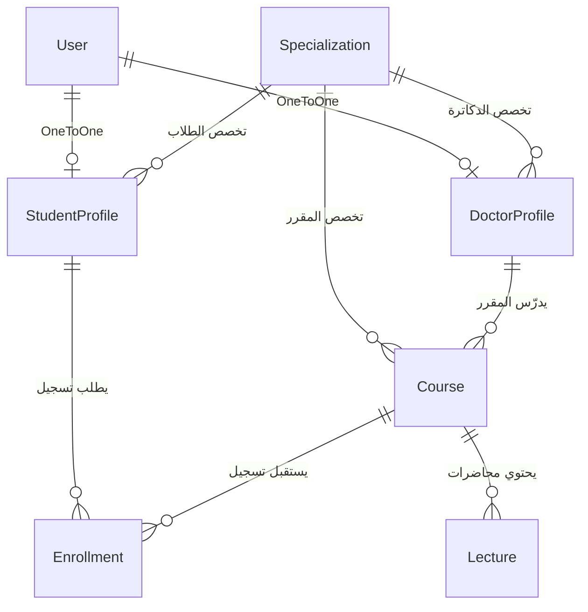

# 🎓 دليل مناقشة وشرح مشروع "منصة التعليم الجامعية" (edu_plat)

هذا الدليل أُعد خصيصاً لمساعدتك على **فهم كل سطر برمجي في المشروع**، و**استعراضه بثقة واحترافية أمام الدكتور والمناقشين**، مع إجابات نموذجية لأهم الأسئلة التي قد يطرحها عليك الدكتور.

---

## 📌 فهرس الدليل
1. [فكرة المشروع وأهدافه العامة](#1-فكرة-المشروع-وأهدافه-العامة)
2. [المعمارية البرمجية ونمط التصميم (Django MTV)](#2-المعمارية-البرمجية-ونمط-التصميم-django-mtv)
3. [هيكلية قاعدة البيانات والعلاقات (Database Schema)](#3-هيكلية-قاعدة-البيانات-والعلاقات-database-schema)
4. [الأمان والصلاحيات ودورة حياة الطلب](#4-الأمان-والصلاحيات-ودورة-حياة-الطلب)
5. [بيانات الدخول التجريبية الجاهزة للعرض](#5-بيانات-الدخول-التجريبية-الجاهزة-للعرض)
6. [سيناريو العرض العملي خطوة بخطوة (Live Demo)](#6-سيناريو-العرض-العملي-خطوة-بخطوة-live-demo)
7. [الأسئلة المتوقعة من الدكتور وكيفية الإجابة عليها](#7-الأسئلة-المتوقعة-من-الدكتور-وكيفية-الإجابة-عليها)

---

## 1. فكرة المشروع وأهدافه العامة

### ما هو المشروع؟
منصة ويب أكاديمية متكاملة تهدف إلى رقمنة العملية التعليمية داخل الكليات والجامعات، وتنظيم العلاقة الأكاديمية بين **عضو هيئة التدريس (الدكتور)** و**الطلاب** تحت إشراف **إدارة الكلية (Admin)**.

### ما المشاكل التي يعالجها المشروع؟
- تشتت المحتوى الأكاديمي والملفات بين منصات التواصل وتطبيقات المراسلة.
- غياب آلية واضحة للتحقق من انتساب الطالب للتخصص والمستوى الدراسي المناسب قبل دخوله للمقرر.
- الحاجة لواجهة متجاوبة، حديثة وسهلة الاستخدام باللغة العربية مع دعم كامل للاتجاه من اليمين لليسار (RTL).

---

## 2. المعمارية البرمجية ونمط التصميم (Django MTV)

يعتمد إطار العمل **Django** على نمط تصميمي شهير يُعرف بـ **MTV (Model - Template - View)**، وهو تنويع أكاديمي لنمط **MVC**:

```
      [المستخدم / المتصفح]
               │  ▲
   1. طلب HTTP │  │ 6. صفحة HTML كاملة
               ▼  │
          [urls.py] (الموجه ومطابق الروابط)
               │
               ▼
          [views.py] (دوال المعالجة ومنطق الأعمال)
           │      ▲
  2. طلب   │      │ 5. دمج البيانات
    بيانات │      │    بالقالب
           ▼      │
      [models.py] └── [templates/*.html]
    (قاعدة البيانات)   (واجهة العرض وتنسيق DTL)
```

1. **Model (`courses/models.py`)**:
   - يمثل بنية البيانات وجداولها في قاعدة البيانات عبر **Django ORM** دون الحاجة لكتابة استعلامات SQL يدوية.
2. **Template (`templates/`)**:
   - واجهة المستخدم المصممة بلغة **DTL (Django Template Language)** مع HTML5 و CSS3 متطور ومخصص ونظام RTL.
3. **View (`courses/views.py`)**:
   - حلقة الوصل ومنطق النظام؛ يستقبل طلب الـ HTTP، يتحقق من صلاحيات المستخدم، يستخرج البيانات من الـ Model، ويمررها للـ Template.

---

## 3. هيكلية قاعدة البيانات والعلاقات (Database Schema)

يتكون النظام من 6 نماذج (Models) مترابطة منطقياً:



### تفاصيل الجداول والعلاقات:
1. **`Specialization` (التخصصات الأكاديمية)**:
   - يحتوي على اسم التخصص (مثل: تقنية المعلومات، علوم الحاسب، هندسة البرمجيات).
2. **`StudentProfile` (ملف الطالب الأكاديمي)**:
   - يرتبط بـ `User` بعلاقة **OneToOne** (`CASCADE`).
   - يحتوي على: الرقم الجامعي `university_id` (Unique)، التخصص `specialization` (`PROTECT`)، والمستوى الدراسي `level` (1 إلى 8).
3. **`DoctorProfile` (ملف عضو هيئة التدريس)**:
   - يرتبط بـ `User` بعلاقة **OneToOne** (`CASCADE`).
   - يحتوي على: الرقم الوظيفي `employee_id` (Unique)، والتخصص `specialization` (`PROTECT`).
4. **`Course` (المقرر الدراسي)**:
   - يرتبط بـ `DoctorProfile` بعلاقة **ForeignKey** (أستاذ المقرر).
   - يرتبط بـ `Specialization` والمستوى الدراسي المستهدف `level`.
   - يحتوي على ملف المقرر (Syllabus/Course File) وتوصيف المقرر.
5. **`Lecture` (المحاضرة)**:
   - يرتبط بالمقرر `Course` بعلاقة **ForeignKey**.
   - يحتوي على: رقم المحاضرة `number`، العنوان `title`، الوصف `description`، ملف المحاضرة (PDF/Docx)، فيديو المحاضرة (MP4)، وأهم النقاط والمفاهيم `points`.
   - يمتلك قيد فرادة مركب: `unique_together = ["course", "number"]` لمنع تكرار نفس رقم المحاضرة داخل المقرر الواحد.
6. **`Enrollment` (طلب التسجيل الأكاديمي)**:
   - يربط بين الطالب والمقرر بحالات:
     - `pending` (قيد المراجعة).
     - `approved` (مقبول).
     - `rejected` (مرفوض).
   - يمتلك قيد فرادة: `UniqueConstraint(fields=["student", "course"])` لمنع الطالب من إرسال أكثر من طلب لنفس المقرر.

---

## 4. الأمان والصلاحيات ودورة حياة الطلب

1. **التحكم بالوصول بناءً على الدور (Role-Based Access Control - RBAC)**:
   - تم بناء مُزخرفات حماية مخصصة (Custom Decorators):
     - `@doctor_required`: يمنع أي طالب أو زائر غير مصرح له من دخول صفحات إدارة المحاضرات أو قبول الطلاب (يعيد كود خطأ HTTP 403).
     - `@student_required`: يمنع الدكاترة من تقديم طلبات تسجيل الطلاب أو دخول بواباتهم.
2. **سياق البيانات الأكاديمي الموحد (`academic_context`)**:
   - عبر `courses/context_processors.py`، يتم تزويد جميع الصفحات والقوائم الجانبية تلقائياً بـ `user_role`، وعدد طلبات التسجيل المعلقة `pending_requests_count` لإظهار الشارات والتنبيهات الحية فوراً.
3. **الحماية ضد هجمات الويب**:
   - **CSRF Protection**: تضمين `` في كافة الاستمارات.
   - **SQL Injection**: الاعتماد الكامل على استعلامات Django ORM الآمنة بـ Parameterized Queries.
   - **XSS Protection**: التعقيم التلقائي لمدخلات المستخدم في قوالب Django.

---

## 5. بيانات الدخول التجريبية الجاهزة للعرض

إذا كنت تريد تجربة النظام بنفسك وبناء بياناتك يدويّاً من الصفر (حسابات، مقررات، محاضرات، طلاب)، اتبع هذه الخطوات البسيطة:

### الخطوة 0: التأكد من نظافة قاعدة البيانات (Clean Slate)
إذا أردت تصفير أي بيانات سابقة والبدء من صفحة بيضاء:
```bash
python manage.py flush
```
(سيطلب منك التأكيد بكتابة `yes`، وسيقوم بحذف كافة البيانات مع الحفاظ على الجداول فارغة وجاهزة).

---

### الخطوة 1: إنشاء حساب مدير النظام (Superuser)
للوصول للوحة التحكم الإدارية، اكتب في التيرمنال:
```bash
python manage.py createsuperuser
```
(أدخل اسم المستخدم مثل `admin`، وبريدك الإلكتروني، وكلمة المرور).

ثم شغّل السيرفر:
```bash
python manage.py runserver
```

---

### الخطوة 2: إضافة التخصصات الأكاديمية (الخطوة الأولى والأساسية)
1. افتح المتصفح وادخل على لوحة الإدارة: `http://127.0.0.1:8000/admin/`.
2. سجّل الدخول بحساب المدير الذي أنشأته.
3. اضغط على **Specializations** ثم **Add Specialization** (إضافة تخصص).
4. أضف التخصصات التي تريدها (مثال: `تقنية المعلومات`، `علوم الحاسب`، `هندسة البرمجيات`).
> 💡 **ملاحظة هامة**: يجب إضافة تخصص واحد على الأقل، لأن استمارة تسجيل الطلاب والدكاترة تطلب اختيار تخصص أكاديمي.

---

### الخطوة 3: تجربة تسجيل حساب طالب جديد (من الواجهة)
1. افتح صفحة إنشاء الحساب: `http://127.0.0.1:8000/register/`.
2. اختر **"حساب طالب"**.
3. أدخل الاسم الكامل، الرقم الجامعي، البريد، اختر التخصص والمستوى الدراسي (مثلاً: المستوى الثالث)، وكلمة المرور.
4. اضغط **"إنشاء الحساب الأكاديمي"**.
5. ستلاحظ أنه سجّل دخولك فوراً ونقلك إلى **لوحة تحكم الطالب**.

---

### الخطوة 4: تجربة تسجيل حساب عضو هيئة تدريس (دكتور)
1. سجّل الخروج من حساب الطالب، ثم عد إلى صفحة `http://127.0.0.1:8000/register/`.
2. اختر **"حساب دكتور"**.
3. عبّئ البيانات (الاسم، الرقم الوظيفي، البريد، التخصص، وكلمة المرور).
4. اضغط **"إنشاء الحساب"**.
5. ستظهر لك رسالة تنبيه تفيد بأن الحساب يتطلب اعتماد الإدارة.
6. اذهب إلى لوحة الأدمن `http://127.0.0.1:8000/admin/courses/doctorprofile/`.
7. حدد الدكتور، ومن قائمة الأوامر (Actions) اختر **"تفعيل حسابات أعضاء هيئة التدريس المحددة"** واضغط Run.
8. الآن يمكن للدكتور تسجيل الدخول بنجاح من صفحة `/login/`!

---

### الخطوة 5: تجربة إضافة مقرر ومحاضرة
1. من لوحة الأدمن (أو أستاذ المقرر)، أضف مقرراً دراسياً واسنده للدكتور.
2. سجّل الدخول بحساب الدكتور، ادخل على **"موادي"** ثم اختر المقرر.
3. اضغط **"إضافة محاضرة جديدة"**، اكتب العنوان والنقاط الأساسية وارفع ملف PDF أو فيديو.
4. اضغط **"حفظ المحاضرة"**؛ ستراها معروضة مباشرة بالترتيب.

---

### الخطوة 6: دورة حياة طلب التسجيل (من الطالب للدكتور)
1. سجّل الدخول بحساب الطالب، واذهب إلى **"المقررات المتاحة"**.
2. ستجد المقرر التابع لتخصصك، اضغط زر **"طلب التسجيل"**.
3. ستتحول الشارة إلى **"قيد المراجعة"**.
4. سجّل الدخول بحساب الدكتور؛ ستلاحظ ظهور إشعار رقمي في القائمة الجانبية عند **"طلبات التسجيل"**.
5. ادخل على الطلبات واضغط **"قبول"**.
6. عند عودة الطالب لحسابه، سيجد المقرر قد أصبح ضمن **"مقرراتي"**، ويمكنه فتح المحاضرة ومشاهدة الفيديو وتحميل الملفات!

---

## 7. الأسئلة المتوقعة من الدكتور وكيفية الإجابة عليها

### س 1: لماذا قمت بفصل ملفات الـ Profiles عن جدول User الافتراضي؟
> **الإجابة النموذجية**: 
> "استخدمت نمط **One-to-One Profile Extension** الموصى به رسمياً في توثيق Django. جدول `User` الأساسي مخصص فقط للمصادقة وتخزين بيانات الهوية الأساسية (الاسم، البريد، كلمة المرور المشفرة)، بينما البيانات الأكاديمية التخصصية تختلف كلياً بين الطالب (رقم جامعي، تخصص، مستوى دراسي) والدكتور (رقم وظيفي، صلاحيات إشراف). هذا الفصل يضمن مبدأ مسؤولية المكون الواحد (Single Responsibility Principle) ويسهل التوسع المستقبلي."

---

### س 2: كيف تمنع الطالب من الوصول لصفحات الدكتور بتغيير الرابط في المتصفح؟
> **الإجابة النموذجية**:
> "لا نعتمد فقط على إخفاء الروابط في الواجهة؛ بل هناك حماية برمجية صارمة على مستوى السيرفر (Server-side Enforcement) باستخدام مخصص `@doctor_required` و `@student_required`. إذا حاول طالب كتابة رابط إضافة محاضرة مباشرة في المتصفح، سيكتشف الـ Decorator أن المستخدم الحالي لا يملك `DoctorProfile`، وسيقوم فوراً برفض الطلب وإرجاع صفحة **HTTP 403 Forbidden** المخصصة في المشروع."

---

### س 3: ما فائدة استخدام Context Processor في المشروع؟
> **الإجابة النموذجية**:
> "أنشأنا دالة `academic_context` في `courses/context_processors.py`. فائدتها هي حقن المتغيرات العامة (مثل: دور المستخدم الحالي `user_role`، وعدد طلبات التسجيل المعلقة `pending_requests_count`) في جميع صفحات وقوالب الموقع تلقائياً. بدونها، كنا سنضطر لتكرار نفس كود جلب الإشعارات وحساب الصلاحيات في أكثر من 15 دالة عرض داخل `views.py`، وهذا يطبق مبدأ البرمجة النظيفة **DRY (Don't Repeat Yourself)**."

---

### س 4: كيف تمنع الطالب من تقديم أكثر من طلب لنفس المقرر؟
> **الإجابة النموذجية**:
> "طبقنا الحماية على مستويين:
> 1. **مستوى قاعدة البيانات (Database Level)**: باستخدام `UniqueConstraint(fields=['student', 'course'])` في نموذج `Enrollment` لمنع تكرار أي سجل لنفس الطالب والمقرر.
> 2. **مستوى منطق الأعمال (Backend Logic)**: داخل دالة `student_course_enroll` نستخدم `get_or_create`، فإذا كان الطالب قد قدم طلباً مسبقاً، يتم تحديث حالته بدلاً من محاولة إدراج سجل مكرر."

---

### س 5: أين تُخزن الملفات والمحاضرات وكيف يتم حمايتها في الإنتاج؟
> **الإجابة النموذجية**:
> "في بيئة التطوير، يتم التخزين في مجلد `media/` المحلي وتخديمه عبر `settings.MEDIA_URL` و `settings.MEDIA_ROOT`. وفي بيئات الإنتاج (Production)، يتيح Django ربط إعدادات التخزين بـ Cloud Object Storage مثل AWS S3 أو Azure Blob Storage بدون الحاجة لتغيير كود الـ Models إطلاقاً."

---

### س 6: ما هو دور ملف `static` وملف `templates`؟
> **الإجابة النموذجية**:
> "`templates` يحتوي على هياكل صفحات HTML المبنية بنظام وراثة القوالب (`base.html` كمخطط أساسي ترث منه باقي الصفحات)، بينما `static` يحتوي على ملفات التنسيق CSS، الخطوط، الصور، ومكتبات JavaScript."
