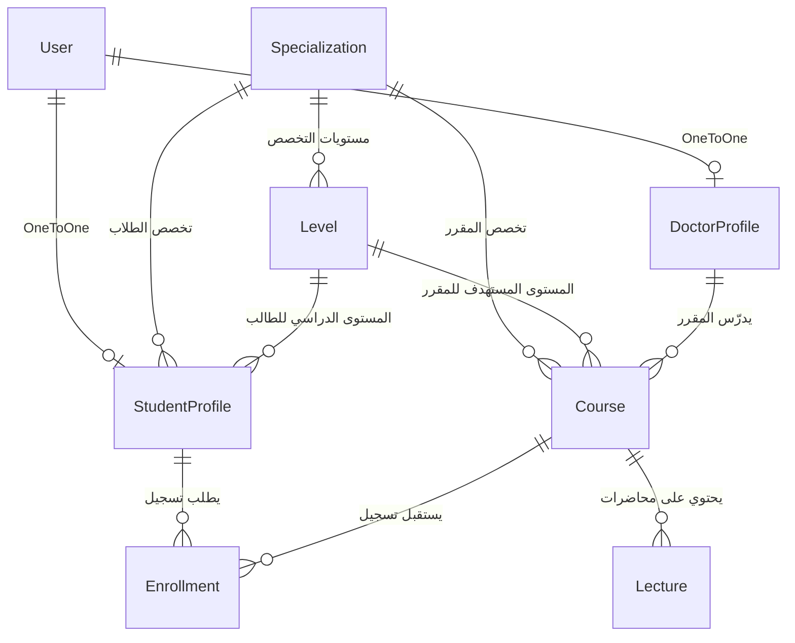

<div align="center">

# 🎓 منصة التعليم الجامعية المتكاملة | University Educational Platform


**منصة ويب أكاديمية حديثة لإدارة العملية التعليمية والمقررات الدراسية، مصممة بنمط معمارية MTV بالاعتماد على إطار العمل Django مع واجهة مستخدم عربية بالكامل (RTL) وتجربة مستخدم عصرية.**

[المميزات](#-المميزات-الرئيسية) • [هيكلية النظام](#-هيكلية-قاعدة-البيانات-والعلاقات-er-diagram) • [طريقة التثبيت](#-دليل-التثبيت-والتشغيل-المحلي) • [الأمان والصلاحيات](#-الأمان-ونظام-التحكم-بالوصول-rbac)

---

</div>

## 📖 نبذة عن المشروع

تعتبر **منصة التعليم الجامعية** حلاً رقمياً متكاملاً لإدارة الفصول الدراسية في الجامعات والكليات؛ تهدف إلى تنظيم العلاقة الأكاديمية بين **الطلاب** و**أعضاء هيئة التدريس (الدكاترة)** تحت إشراف **إدارة النظام (Admin)**، وتوفير بيئة تعليمية مركزية بديلة لتشتت الملفات في تطبيقات المراسلة.

---

## ✨ المميزات الرئيسية

### 👨‍🎓 1. بوابة الطالب (Student Portal):
* **تسجيل أكاديمي ذكي:** اختيار التخصص والقسم والمستوى الدراسي الحالي عند التسجيل، مع الدخول الفوري للداشبورد.
* **عرض المقررات المتاحة بدقة:** تصفية وعرض المقررات تلقائياً بحسب **تخصص الطالب** و**مستواه الدراسي (Level)** فقط.
* **نظام طلبات التسجيل (Enrollment System):** إرسال طلب انضمام للمقرر الدراسي مع تتبع لحظي لحالة الطلب:
  * ⚪ `متاح` (يمكن تقديم طلب)
  * 🟡 `قيد المراجعة` (بانتظار موافقة الدكتور)
  * 🟢 `مسجل ومقبول` (الدخول إلى المقرر والمحاضرات)
  * 🔴 `مرفوض` (إمكانية إعادة تقديم الطلب)
* **قاعة المحاضرات التفاعلية:** مشاهدة محاضرات المقرر، استعراض ملخص النقاط الرئيسية، تحميل ملفات المحاضرة (PDF/Word)، ومشاهدة الفيديو التعليمي مباشرة.

### 👨‍🏫 2. بوابة الدكتور / عضو هيئة التدريس (Doctor Portal):
* **لوحة تحكم إحصائية (KPIs Dashboard):** إحصائيات سريعة عن عدد المقررات المسندة، إجمالي الطلاب المقبولين، المحاضرات المنشورة، وطلبات التسجيل المعلقة.
* **إدارة المحاضرات:** إضافة وتعديل وحذف المحاضرات مع رفع ملفات الشرح ومقاطع الفيديو وكتابة النقاط الأساسية.
* **إدارة وتصفية طلبات التسجيل:** مراجعة طلبات انضمام الطلاب للمقررات، وقبولها أو رفضها بضغطة زر واحدة.
* **ملف الدكتور الأكاديمي:** استعراض بيانات الدكتور وتخصصاته ورقمه الوظيفي.

### 🛡️ 3. لوحة إدارة الكلية (Django Admin):
* إدارة الأقسام والتخصصات الأكاديمية (`Specializations`).
* إدارة المستويات الدراسية لكل تخصص (`Levels`).
* إنشاء المقررات الدراسية وإسنادها للدكتور المعني وتحديد تخصصها ومستواها.
* تفعيل وتعطيل حسابات أعضاء هيئة التدريس المعتمدين (`Activate / Deactivate Doctors`).
* الإشراف الكامل على طلبات التسجيل وتوثيق تواريخ القبول والرفض.

---

## 🏗️ المعمارية البرمجية ونمط التصميم (Architecture)

تم بناء المنصة وفق نمط تصميم **Django MTV (Model - Template - View)**:

```text
[المتصفح / الطالب أو الدكتور]
           │  ▲
 1. Request│  │ 6. Response (HTML)
           ▼  │
      [urls.py] ────> شرطي المرور ومطابق الروابط
           │
           ▼
      [views.py] ───> العقل المدبر ومنطق الأعمال وفحص الصلاحيات
       │      ▲
2. ORM │      │ 5. Render Context
       ▼      │
  [models.py] └───> [templates/*.html]
 (قاعدة البيانات)     (واجهات العرض مع DTL ونظام التصميم المخصص)
```

---

## 🗄️ هيكلية قاعدة البيانات والعلاقات (ER Diagram)



### ملخص النماذج الأساسية (`courses/models.py`):
1. **`Specialization`**: التخصصات (مثل: تقنية المعلومات، علوم الحاسوب).
2. **`Level`**: المستويات الدراسية التابعة للتخصص بترتيب مرقم.
3. **`StudentProfile`**: بيانات الطالب، رقمه الجامعي الفريد، تخصصه، ومستواه.
4. **`DoctorProfile`**: بيانات الأستاذ، رقمه الوظيفي، وتخصصاته المسندة.
5. **`Course`**: المقرر الأكاديمي، ملف المنهج (Syllabus)، والتوصيف.
6. **`Lecture`**: المحاضرة برقم ترتيبي مميز لكل مادة، والملف، والفيديو، والنقاط الرئيسية.
7. **`Enrollment`**: علاقة تسجيل الطالب بالمقرر مع قيد فرادة لمنع التكرار وحفظ تواريخ الطلب والقرار.

---

## 🔒 الأمان ونظام التحكم بالوصول (RBAC)

* **المزخرفات المخصصة (Custom Decorators):**
  * `@doctor_required`: حماية مسارات الدكتور والتحقق من هوية المستخدم ودوره الإشرافي.
  * `@student_required`: حماية مسارات الطالب ومنع غير المسجلين من الوصول.
* **حماية النماذج (CSRF Protection):** تفعيل حماية تزوير الطلبات في كل نماذج الإدخال.
* **تشفير كلمات المرور:** اعتماد خوارزمية التجزئة أحادية الاتجاه (PBKDF2 SHA-256) في جانغو.
* **معالجة مخصصة لصفحات الخطأ:** صفحات مخصصة ومصممة بالكامل للأخطاء (403 Forbidden ، 404 Not Found ، 500 Server Error).

---

## 📂 هيكلية مجلدات المشروع (Directory Structure)

```text
edu_platform/
├── courses/                      # التطبيق الأساسي للمنصة (Core App)
│   ├── models.py                 # نماذج وقواعد بيانات النظام
│   ├── views.py                  # منطق المعالجة والبوابات (طالب / دكتور / عام)
│   ├── urls.py                   # مسارات وتوجيه الروابط داخل التطبيق
│   ├── forms.py                  # نماذج تسجيل ومصادقة وإدخال البيانات
│   ├── admin.py                  # تخصيص لوحة تحكم الإدارة والإجراءات السريعة
│   └── context_processors.py     # تزويد كل القوالب بحالة المستخدم ودوره تلقائياً
├── edu_plat/                     # مجلد إعدادات المشروع الرئيسي
│   ├── settings.py               # إعدادات التطبيقات، قواعد البيانات، والوسائط
│   ├── urls.py                   # موجه الروابط الرئيسي والـ Handlers
│   └── wsgi.py                   # إعدادات نشر الخادم
├── templates/                    # قوالب واجهات العرض (HTML/DTL)
│   ├── base.html                 # الهيكل الأساسي (Navbar, Sidebar, Footer)
│   ├── components/               # مكونات مكررة (Course Card, Stat Card, Pagination)
│   ├── doctor/                   # شاشات بوابة الدكتور
│   ├── student/                  # شاشات بوابة الطالب
│   └── registration/             # شاشات تسجيل الدخول وإنشاء الحسابات
├── static/                       # الملفات الثابتة (CSS, JS, Fonts, Icons)
├── media/                        # مجلد الملفات المرفوعة (المقررات والفيديوهات)
├── manage.py                     # أداة التحكم والتنفيذ في جانغو
└── README.md                     # دليل المشروع التعريفي
```

---

## 🚀 دليل التثبيت والتشغيل المحلي (Quickstart)

اتبع الخطوات التالية لتشغيل المشروع على جهازك المحلي:

### 1. استنساخ المستودع (Clone Repository):
```bash
git clone https://github.com/your-username/edu_platform.git
cd edu_platform
```

### 2. إنشاء وتفعيل البيئة الافتراضية (Virtual Environment):
* **على نظام Windows:**
  ```powershell
  python -m venv my_env
  .\my_env\Scripts\activate
  ```
* **على أنظمة Linux / macOS:**
  ```bash
  python3 -m venv my_env
  source my_env/bin/activate
  ```

### 3. تثبيت المتطلبات (Install Dependencies):
```bash
pip install django pillow
```

### 4. تطبيق تهجيرات قاعدة البيانات (Run Migrations):
```bash
python manage.py migrate
```

### 5. إنشاء حساب مدير النظام (Create Superuser):
```bash
python manage.py createsuperuser
```

### 6. تشغيل الخادم المحلي (Run Server):
```bash
python manage.py runserver
```

افتح المتصفح وتوجه إلى:
* المنصة الرئيسية: `http://127.0.0.1:8000/`
* لوحة تحكم الإدارة: `http://127.0.0.1:8000/admin/`

---

## 🛠️ التقنيات المستخدمة (Tech Stack)

* **Backend:** Python 3, Django Web Framework.
* **Database:** SQLite (افتراضياً للتطوير المحلي - قابلة للتحويل إلى PostgreSQL أو MySQL).
* **Frontend:** Vanilla HTML5, CSS3 Custom Modern Architecture, Flexbox & CSS Grid.
* **Icons:** Bootstrap Icons.
* **Architecture:** MTV (Model - Template - View) with Service/Context Separation.

---

## 📄 الترخيص (License)

هذا المشروع متاح تحت رخصة **MIT License**. يمكنك الاطلاع على ملف [LICENSE](LICENSE) لمزيد من التفاصيل.
